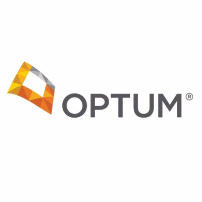

# Work

### Full-Stack Software Developer, June 2017 - present
Optum, Raleigh, NC

* Technology Development Program (first year).
    1. First Rotation: FHIR data and cloud applications development.
    2. Second Rotation: Cloud Technology, Container Orchestration, API development.
* Successfully designed and developed full-stack cloud applications using modern industry adopted languages and frameworks.
* Automated and implemented DevOps solutions, which resulted in improved delivery time and quality of the products.
* Collaborated with cross-functional development team members to analyze potential system solutions based on evolving client requirements.
* Developed centralized API catalog.
* Helped develop internal data auditing tool.
* Onborded new hires and helped getting them up to speed.

 

### Software Engineer Intern, May 2016 - August 2016
Optum, Greenville, SC

* Maintained and updated legacy code, helped team's transition to Agile and Cloud application development.
* Designed and developed reports from a data lake using SQL.
* Redesigned database mapping to combine existing instances into one.

 
